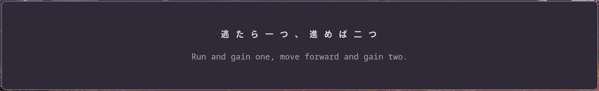
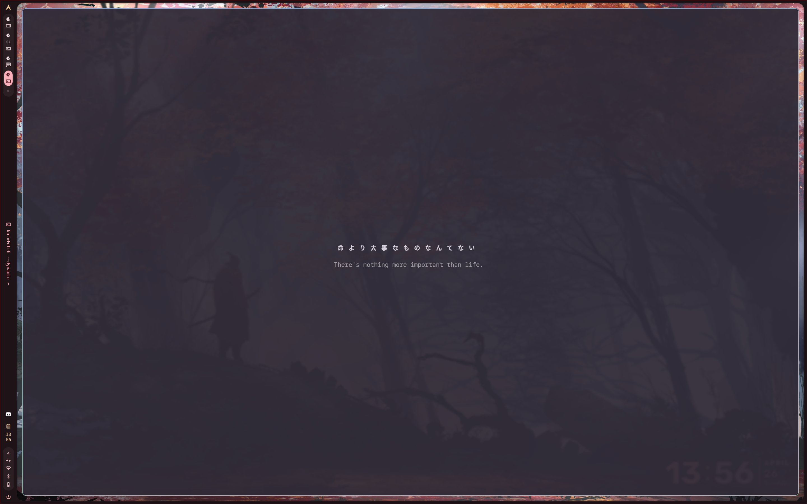
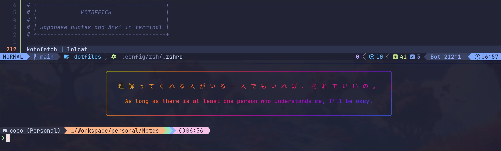
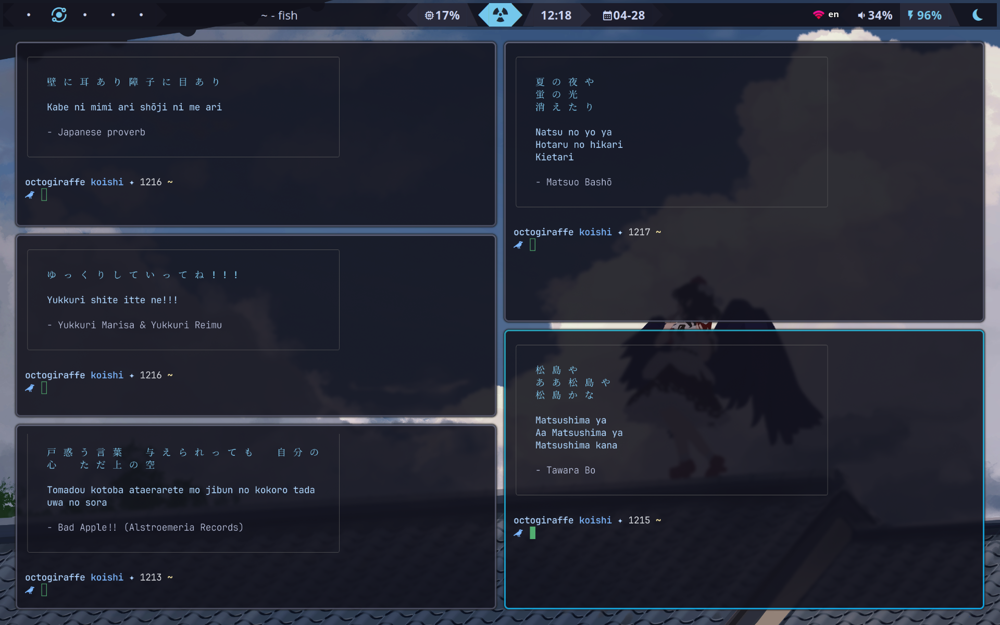
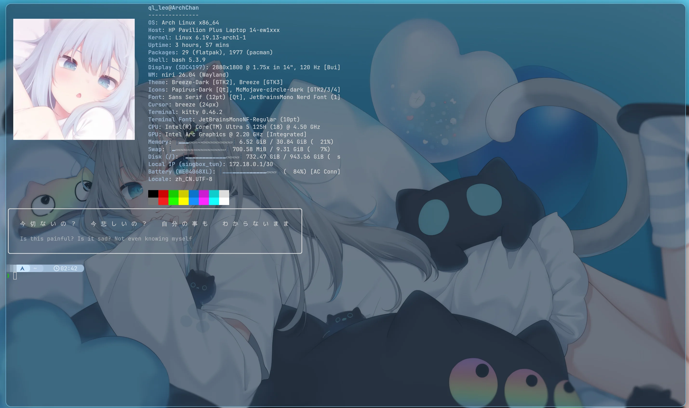

###### コトフェッチ
# kotofetch

**kotofetch** is a small, configurable CLI tool that displays Japanese quotes in the terminal. It comes with built-in quotes and allows users to customize display options such as padding, width, translation display, and text styles.



## Contents
- [Installation](#installation)
  - [Arch Linux / AUR](#arch-linux--aur)
  - [Nix / NixOS](#nix--nixos)
  - [Prebuilt Binaries](#prebuilt-binaries)
  - [From Source](#from-source)
- [Requirements](#requirements)
- [Configuration](#configuration)
  - [Config File](#config-file)
  - [Importing Anki decks](#importing-anki-decks)
  - [Custom quotes](#custom-quotes)
- [Usage](#usage)
  - [Translation Modes](#translation-modes)
- [Community Showcase](#community-showcase)
- [Contributing](#contributing)

## Installation

> [!NOTE]
> The latest release does not contain all the built-in quotes.  
> If you want all the built-in quotes, please add them manually by checking the [quotes](quotes) folder.

### Arch Linux / AUR
You can install the stable release from the AUR using any AUR helper:

```bash
yay -S kotofetch
```

Or by cloning the AUR from [here](https://aur.archlinux.org/packages/kotofetch):
```bash
git clone https://aur.archlinux.org/kotofetch.git
cd kotofetch
makepkg -si
```

### Nix / NixOS
If you use Nix, you can install `kotofetch` using those commands:
```bash
git clone https://github.com/hxpe-dev/kotofetch.git
cd kotofetch
nix-build
```

### Prebuilt Binaries
You can download prebuilt binaries for **Linux**, **Windows** and **macOS** from the [Releases page](https://github.com/hxpe-dev/kotofetch/releases).

| System / Distribution | File Extension | Description |
|:----------------------|:---------------|:------------|
| **Generic Linux** | `.tar.gz`      | The most universal build. Extract and run the binary. |
| **Debian / Ubuntu** | `.deb`         | Install using `dpkg`. |
| **Fedora / CentOS / openSUSE** | `.rpm`  | For all RPM-based systems. |
| **Windows** | `.exe` or `.zip` | The standalone **`.exe`** is ready to run. The **`.zip`** contains the executable. |
| **macOS** | `.tar.gz`      | Extract and run the binary. |

### From Source
Requires **Rust** and **Cargo**:

```bash
git clone https://github.com/hxpe-dev/kotofetch.git
cd kotofetch
cargo install --path .
```

After installation, you can run `kotofetch` from anywhere in your terminal.

## Requirements

You need to have a Japanese font installed on your machine.

One popular choice is the **Noto CJK Font**.

#### Install Noto CJK Font on Arch Linux
```
sudo pacman -S noto-fonts-cjk
```

#### Install Noto CJK Font on Ubuntu / Debian
```
sudo apt update
sudo apt install fonts-noto-cjk
```

#### Install Noto CJK Font on Fedora
```
sudo dnf install google-noto-cjk-fonts
```

#### Install Noto CJK Font on OpenSUSE
```
sudo zypper install noto-fonts-cjk
```

#### Install Noto CJK Font on macOS (with Homebrew)
```
brew tap homebrew/cask-fonts
brew install --cask font-noto-sans-cjk
```


## Configuration

### Config File

User configuration lives in:  
```bash
~/.config/kotofetch/config.toml                       # On Linux
~/Library/Application Support/kotofetch/config.toml   # On macOS
%APPDATA%\kotofetch\config.toml                       # On Windows
```

Here you can customize:
- `horizontal_padding` / `vertical_padding` - spacing around quotes
- `width` - max width for text wrapping (`0` for automatic width)
- `show_translation` - translation modes to display; accepts a single value (`"english"`) or an array (`["english", "romaji"]`); available values: `"none"`, `"english"`, `"romaji"`, `"furigana"`
- `quote_color` - named ANSI colors (`"red"`, `"yellow"`, `"dim"`, etc.) or hex (`"#ffcc00"`)
- `translation_color` - named ANSI colors (`"red"`, `"yellow"`, `"dim"`, etc.) or hex (`"#ffcc00"`)
- `border_color` - named ANSI colors (`"red"`, `"yellow"`, `"dim"`, etc.) or hex (`"#ffcc00"`)
- `font_size` - small, medium, or large (adds spacing between characters)
- `bold` - bold Japanese text (true/false)
- `border` - show a box border (true/false)
- `rounded_border` - show rounded border (need `border` to be enabled) (true/false)
- `source` - show the quote source (true/false)
- `modes` - list of quote files to use (any `.toml` file in `~/.config/kotofetch/quotes/` or built-in)
- `seed` - RNG seed for random quotes (`0` for random seed)
- `centered` - center text (true/false)
- `dynamic` - dynamic re-centering of the text (true/false)
- `furigana_position` - show furigana `"above"` or `"below"` the Japanese text (default: `"below"`)

Example `config.toml`:
```toml
[display]
horizontal_padding = 3
vertical_padding = 1
width = 50
show_translation = ["furigana", "english"]
quote_color = "#a3be8c"
translation_color = "dim"
border_color = "#be8ca3"
font_size = "medium"
bold = true
border = true
rounded_border = true
source = true
modes = ["proverb", "anime"]
seed = 0
centered = true
dynamic = false
```

### Importing Anki decks

You can import your Anki decks as kotofetch quote files using the **AnkiConnect** plugin.

**Requirements:**
1. Anki desktop must be running.
2. AnkiConnect must be installed (plugin code: `2055492159`).

**Interactive import:**
```bash
kotofetch init anki
```
This connects to `http://localhost:8765`, shows your available decks, and walks you through mapping note fields (japanese text, translation, furigana reading) interactively.

**Non-interactive import (for scripting):**
```bash
kotofetch init anki \
  --deck "Core 2k" \
  --japanese-field Expression \
  --translation-field Meaning \
  --furigana-field Reading \
  --romaji-field Romaji \
  --yes
```

Each imported deck is saved as `~/.config/kotofetch/quotes/<deck-name>.toml`. After importing, use it with:
```bash
kotofetch --modes <deck-name>
```

**Furigana support:** if your note's japanese field contains Anki's native furigana syntax (`食[た]べる`), it is automatically converted to kotofetch's inline format (`食(た)べる`). If the japanese field has no readings, the furigana field is used as a fallback. HTML ruby tags (`<ruby>/<rt>`) are also converted.

### Custom quotes
Built-in quotes are embedded in the binary. To add your own quotes, create:
```bash
~/.config/kotofetch/quotes/                       # On Linux
~/Library/Application Support/kotofetch/quotes/   # On macOS
%APPDATA%\kotofetch\quotes\                       # On Windows
```
- Place any `.toml` file there.
- The filenames can be arbitrary, the program automatically reads all `.toml` files in this folder.
- Each `.toml` must follow this structure:

```toml
[[quote]]
japanese = "逃(に)げちゃダメだ"
translation = "You mustn't run away."
romaji = "Nigeccha dame da"
source = "Neon Genesis Evangelion"

[[quote]]
japanese = "人(ひと)は心(こころ)で生(い)きるんだ"
translation = "People live by their hearts."
romaji = "Hito wa kokoro de ikiru nda"
source = "Your Name"
```

> **Note:** Furigana readings are embedded inline in the `japanese` field using parentheses: `kanji(reading)`. The reading immediately follows the kanji it annotates. Compound (multi-kanji) words can share a single reading, e.g. `大事(だいじ)`. Kanji without a `(reading)` after them simply have no annotation. The parentheses are automatically stripped in non-furigana display modes.
- These custom quotes automatically merge with the built-in ones.

You can see the built-in quotes in the [quotes folder](quotes/).

## Usage
```bash
kotofetch                                 # display a quote following the config
kotofetch --translation furigana          # display furigana readings below kanji
kotofetch --translation english,romaji    # display both English and romaji
kotofetch --furigana-position above       # show furigana readings above the Japanese text
kotofetch --horizontal-padding 3          # override specific config parameter temporarily
kotofetch --modes anime,mycustomquotes    # display quotes from specific files
```

### Translation Modes

| Mode | Description |
|:-----|:------------|
| `none` | Japanese text only |
| `english` | Shows English translation below Japanese |
| `romaji` | Shows romaji (romanized Japanese) below Japanese |
| `furigana` | Shows furigana readings below kanji (if available) |

Multiple modes can be combined by passing a comma-separated list: `--translation english,romaji` or `--translation furigana,english`. Modes are displayed in the order given.

Furigana displays readings aligned with their kanji, supporting both single-kanji annotations (`知(し)`) and compound words (`大海(たいかい)`). Only quotes that include inline ruby markup in their `japanese` field will show furigana readings. Use `--furigana-position above` (or `furigana_position = "above"` in config) to render readings above the Japanese text instead of below.


## Community Showcase

A huge thanks to the community members who shared their setups!

<table align="center">
  <tr>
    <td align="center">
      <br>
      <sub>Setup by <a href="https://github.com/hxpe-dev">@hxpe</a></sub>
    </td>
    <td align="center">
      <br>
      <sub>Setup by <a href="https://www.reddit.com/user/coko_7">@coko_7</a></sub>
    </td>
  </tr>
  <tr>
    <td align="center">
      <br>
      <sub>Setup by <a href="https://github.com/kikeijuu">@kikeijuu</a></sub>
    </td>
    <td align="center">
      <br>
      <sub>Setup by <a href="https://www.reddit.com/user/Traditional_Read9408">@QL_Leo</a></sub>
    </td>
  </tr>
</table>


## Contributing
Contributions are welcome (donations too, they support me a lot in my work)! Here's how you can help:
1. **Fork** the repository.
2. **Clone** your fork locally:
```bash
git clone https://github.com/hxpe-dev/kotofetch.git
cd kotofetch
```
3. **Create a branch** for your changes:
```bash
git checkout -b feature/my-feature
```

4. **Make changes** and **commit**:
```bash
git add .
git commit -m "Add my feature"
```

5. **Push** your branch:
```bash
git push origin feature/my-feature
```

6. **Open a Pull Request** on GitHub!

---

Made with ❤️ by [hxpe](https://github.com/hxpe-dev)  
If you enjoy **kotofetch**, consider starring the [GitHub repository](https://github.com/hxpe-dev/kotofetch)!
